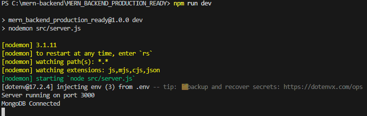
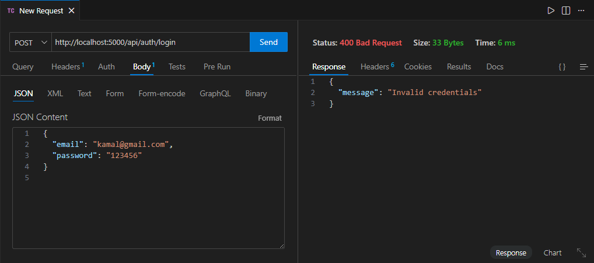
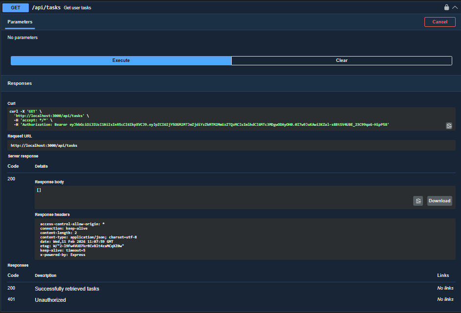
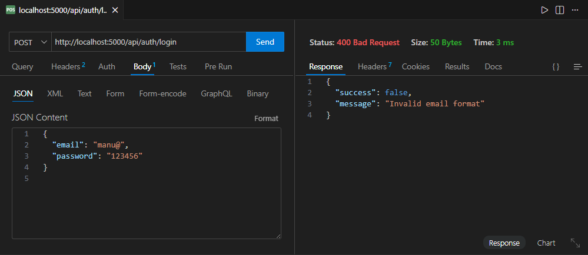

🟢 JWT Authentication – Day 1 (Machine Test)
📌 Project Overview

This project demonstrates JWT-based authentication using Node.js, Express, MongoDB, and JWT.
It covers user registration, login, token generation, authentication middleware, and a protected API.

🚀 Features

User Registration with hashed password
User Login with JWT token generation
JWT authentication middleware
Protected API access using Bearer token
Proper error handling & HTTP status codes

🛠 Tech Stack

Node.js
Express.js
MongoDB (Mongoose)
JWT (jsonwebtoken)
bcryptjs
dotenv

📂 Folder Structure
src/
├── config/db.js
├── models/User.js
├── controllers/
│   ├── authController.js
│   └── taskController.js
├── routes/
│   ├── authRoutes.js
│   └── taskRoutes.js
├── middleware/authMiddleware.js
└── server.js

⚙️ Installation & Setup
npm install
npm run dev

Create a .env file:

PORT=5000
MONGO_URI=mongodb://127.0.0.1:27017/jwt_day1
JWT_SECRET=your_secret_key

🔑 API Endpoints
🔹 Register User

POST /api/auth/register

{
  "name": "Manu",
  "email": "manu@gmail.com",
  "password": "123456"
}

🔹 Login User

POST /api/auth/login
{
  "email": "manu@gmail.com",
  "password": "123456"
}

Response
{
  "token": "JWT_TOKEN"
}

🔒 Protected Route

GET /api/tasks
Headers
Authorization: Bearer JWT_TOKEN

❌ Error Handling

Duplicate email → 400 Bad Request
Invalid credentials → 400 Bad Request
Missing token → 401 Unauthorized
Invalid/expired token → 401 Unauthorized

🧠 Concepts Covered

JWT Authentication
Password Hashing
Middleware
REST API Security
Authorization Headers

🎓 Viva Ready Notes

JWT avoids server-side sessions
Tokens are verified on every request
Password hashing protects user data
Middleware secures protected routes

✅ Output Flow
Register → Login → Receive Token → Access Protected API

Register success 

Register error

Login success

Login error

Protected Route

❓ Why JWT is used?
JWT is used to securely transmit user identity between client and server without storing sessions on the server.

❓ What happens if token is missing?
Server returns 401 Unauthorized because it cannot verify the user.

❓ Why password hashing is mandatory?
To protect user passwords. Even if the database is hacked, hashed passwords cannot be easily reversed.

Folder Structure

Server running 

MongoDB connect

